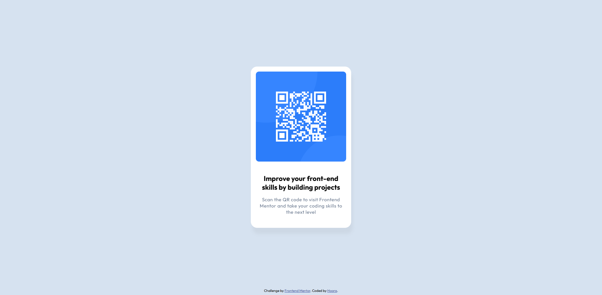

# Frontend Mentor - QR Code Copmonent Solution

This is a solution to the QR Code Copmonent (https://www.frontendmentor.io/challenges/qr-code-component-iux_sIO_H) on Frontend Mentor.  
Frontend Mentor challenges help you improve your coding skills by building realistic projects.

## 📸 Screenshot

## 🔗 Live Demo

👉 [View Live Site](https://your-live-site-url.netlify.app/)  
👉 [View on Frontend Mentor](https://www.frontendmentor.io/solutions/your-solution-link)

## 🧠 What I Learned

> I learned about meta tags which are very important and they control how the browser interprets and displays our webpage.
>
> <meta charset="UTF-8"> -> Purpose: It tells the browser which character enconding we are using in our HTML doc.
> UTF-8 is a universal text format that supports almost every language and special symbol (like emojies, Persian characters, etc.). Without UTF-8, some letters might display as weird boxes or question marks.
> <meta name="viewport" content="width=device-width, initial-scale=1.0"> -> Purpose: It controls how our webpage is displayed on mobile devices and responsive layouts. In short, this line makes our website look normal and responsive on phones and tablest.
> name="viewport" -> means this tag is about the visible area(the viewport).
> content="width=device-width" -> sets the page width equal to the device's screen width. Without this, a phone would try to display our site as if it were a big desktop screenm and it would look zoomed out.
> initial-scale=1.0 -> sets the default zoom level to 100%.
> I also learned about target attribute for anchors:
> <a href="https://www.frontendmentor.io?ref=challenge" target="_blank"> -> when we set target="_blank" it means we want to open this link in a new browser tab. other possible target values are: _self, _parent and _top.
> target="_self" -> (default) Opens the link in the same tab or frame
> target="_parent" -> Opens the link in the parent frame (used with iframes)
> target="_top" -> Opens the link in the full browser window (breaking out of frames)
> I used article tag for my component because semantically, it's a self-contained piece of content that can stand alone (like a product preview or a card or a post).
> I used font-size: 62.5% to make 1rem = 10px for easier calculations.
> I learned how to center an element: first we need to set display:flex on the body, then use align-items and justify-content to center it, and finally set min-height to 100vh.
> I also learned about drop-shadow. It requires at least 2 parameters: the offsets for the x and y axes, respectively. The third parameter is the blur-radius and the forth is the color. 
> Another important thing is the difference between box-shadow and drop-shadow. box-shadow is a CSS property that always creates a rectangular shadow, even if the element is a circle, it ignores transparency inside the element. In contrast, drop-shadow is a CSS filter function that applies to the actual shape of the element, including transparency; the shadow follows the visible pixels, not the box.

## 🛠️ Built With

- Semantic HTML5 markup
- CSS custom properties
- Flexbox

## 🚀 Features

- Responsive design
- Pixel-perfect implementation
- Accessible and semantic HTML

## 📚 Useful Resources

List any resources that helped you during the challenge. Example:

- [MDN Web Docs](https://developer.mozilla.org/en-US/docs/Web/CSS/filter-function/drop-shadow)
- [Figma Learn](https://help.figma.com/hc/en-us/articles/15023124644247-Guide-to-Dev-Mode)
- [Figma Learn](https://help.figma.com/hc/en-us/articles/360041488473-Apply-effects-to-layers)

## 🙌 Acknowledgments

> Challenge by [Frontend Mentor](https://www.frontendmentor.io).  
> Coded by [Hoora](https://github.com/HooraFarhangi).
